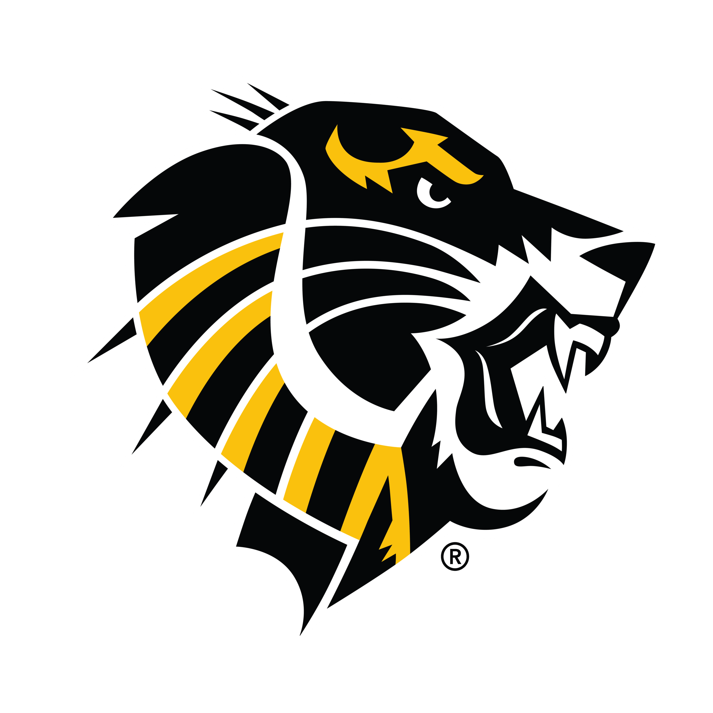

  
  <h2>Welcome to App Development & Emerging Technologies @ Fort Hays Tech | Northwest!</h2>
  

    Goodland, Kansas ·
    <a href="https://www.fhnw.edu">https://www.fhnw.edu</a>
  

  <h3>About App Development & Emerging Technologies</h3>
  
The newly revised App Development & Emerging Technologies (formerly Cloud and Crypto Computing) program prepares students for employment in software and app development. During the first half of the program, students complete a common core of classes that introduce them to five different pathways.  Students choose which one of the five pathways suits their interests and skillsets. Then during the second year of the program, students pursue that one pathway and engage in live work with team members from the other pathways, just as they would work in real-world companies. Live Work on real projects with real employers is the highlight of the pathway experience.

  <h3></h3>

